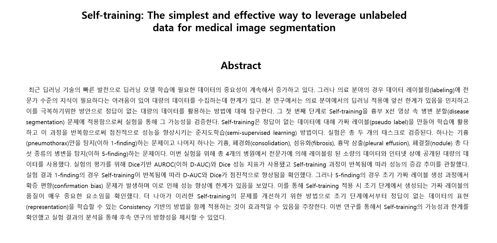

# Pseudo Labeling POC
[연구 리포트](src/AI연구실_연구세미나_Pseudo-labeling_연구결과_240126_김주성.pdf)
 

## 프로젝트 소개
* Self-training 적용과 실험 관리를 위한 baseline 코드

figure1. Training Framework

### 주요 기능
- 모델 학습 - [train.py](./semseg-baseline/train.py)
- 모델 평가 - [evaluation.py](./semseg-evaluation.py)
- Instance segmentation 모델 학습 및 평가 - [detectron2-baseline](./detectron2-basellin)
- pseudo label 생성 - [pseudo_label_creator.py](./semseg-baseline/pseudo_label_creator.py)
- experiment tracking - [wandb](https://github.com/kjs2109/Pseudo_Labeling_POC/blob/8b482dbf0100e0217290eb830792819b54ddcf98/semseg-baseline/train.py#L228)
- [DDP (distributed data parallel)](https://github.com/kjs2109/Pseudo_Labeling_POC/blob/8b482dbf0100e0217290eb830792819b54ddcf98/semseg-baseline/train.py#L215) 
- [Copy-Paste](https://github.com/kjs2109/Pseudo_Labeling_POC/blob/8b482dbf0100e0217290eb830792819b54ddcf98/semseg-baseline/dataset.py#L153)
- [RandAugment](https://github.com/kjs2109/Pseudo_Labeling_POC/blob/8b482dbf0100e0217290eb830792819b54ddcf98/semseg-baseline/utils/augmentation.py#L6)
- [Weighted-soft Ensemble](https://github.com/kjs2109/Pseudo_Labeling_POC/blob/8b482dbf0100e0217290eb830792819b54ddcf98/semseg-baseline/inference/inference_model.py#L7)

### 개발 환경
- Python 3.9.16
- PyTorch 1.9.0+cu111
- GPU: RTX2080Ti x 10

### 사용법
 

figure2. Project Architecture
 
